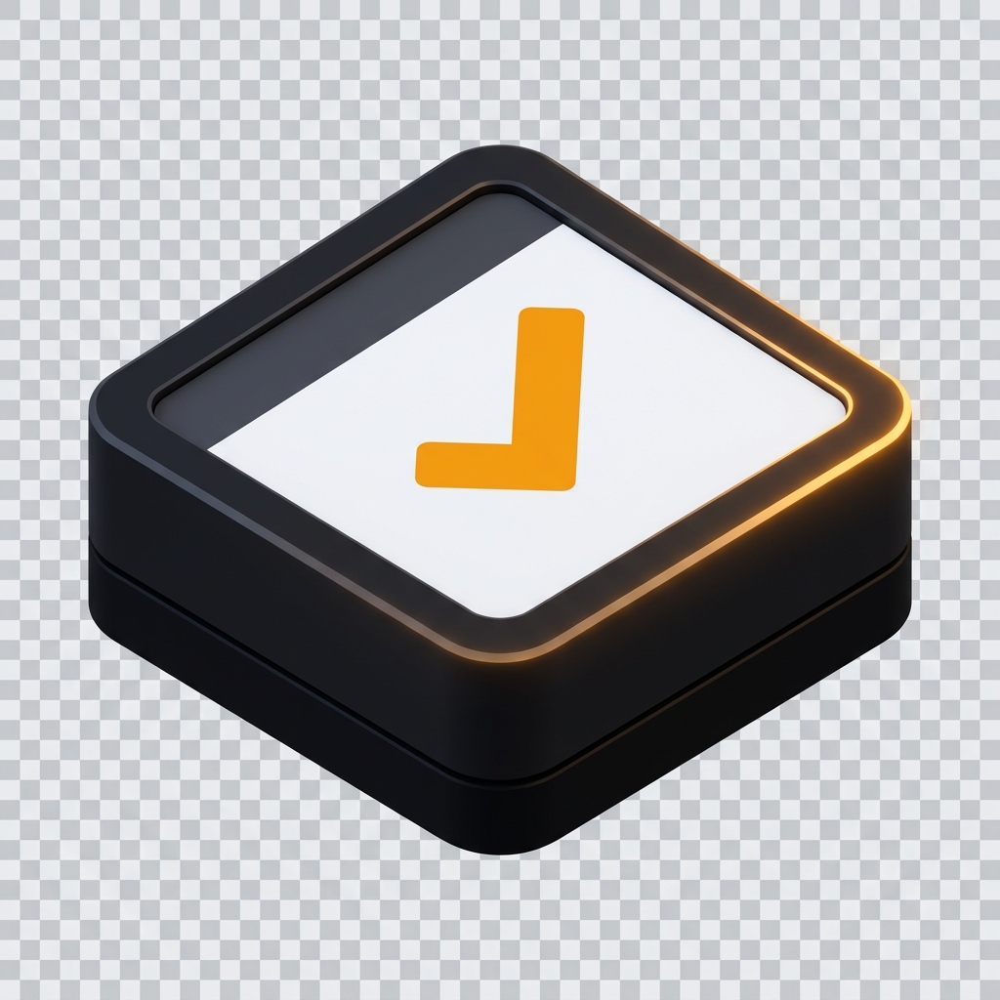

<p align="center">
  
</p>

# Filament Calendar

A polished inline calendar field for [Filament](https://filamentphp.com).

## Documentation

- Local docs: `cd docs && npm install && npm run dev`
- GitHub Pages: https://asmitnepali.github.io/fila-calendar/

## Install

```bash
composer require asmit/fila-calendar
php artisan filament:assets
```

## Quick example

```php
use Asmit\FilaCalendar\Forms\Components\CalendarInput;
use Asmit\FilaCalendar\Support\CalendarMode;

CalendarInput::make('availabilities')
    ->mode(CalendarMode::MultiRange)
    ->months(12)
    ->calendarColumns(4)
    ->withToday()
    ->locale('ja');
```

## License

MIT
